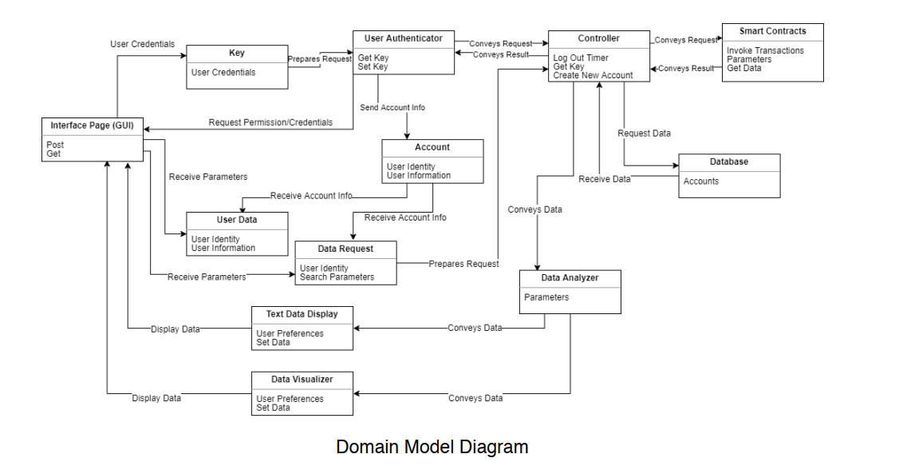

# Thành viên:
* Trần Ngọc Lâm (5*)
* Kiều Duy Nam (5*)
* Nông Ngọc Huân (5*)
* Mai Phúc Lâm (5*)
* Dương Đức Bình (5*)
* Đoàn Hữu Bách (5*)
# 6. Domain Analysis
## 6.a Domain Model
 
### i. Concept definitions
| Responsibility Description | Type | Concept Name | 
| :----- | :---------- | :-------------- | 
| Website with React pages for account log in, account creation, and viewing outcomes and results in UI made from Scalable vector graphics | K | User Interface (GUI)| 
| Form specifying the parameters for data retrieval from the blockchain, as well as parameters for desired data analysis. | K | Data Request | 
| Data input form where the user enters their health information | K | User Data | 
| Render non-graphical data and summaries in an organized way for user-requested data| D|  Text Data Display |
| Create data visualizations for the user-requested data| D| Data Visualizer |
| Establishes a connection to the Ethereum Blockchain. Accepts data requests and user data, and returns the raw data| D| Smart Contract   |
| Analyses the raw data for the requested measurements| D| Data Analyzer |
| Container for user’s authentication data (individual and third-party users)| K| Key  |
| Verifies that a user with appropriate credentials exists. If not, inform the user and proceeds accordingly. Obtain permission for third-party login.| D| User Authenticator |
| Coordinate actions of system concepts and user requests. Responsible for data retrieval and transfer to concepts. Refresh data periodically and log out users after prolonged time| D| Controller |
| Holds account information of a specific user and provides complete flexibility in managing users own data.| K| Account  |
| Stores account data, user data and collaborates in all activities related to data visualization, administration and storage.| K,D| Database   |

### ii. Association definitions
### iii. Attribute definitions
### iv. Traceability Matrix
## 6.b System Operation Contracts
## 6.c Mathematical Model
# 7. Interaction Diagram
# 8. 
